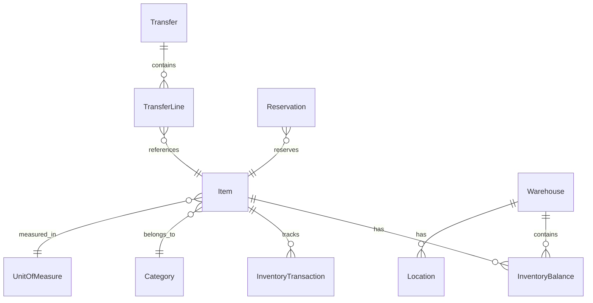

# 📦 Inventory API

A production-ready, multi-tenant Inventory Management API built with .NET 10 and Clean Architecture.

[](https://dotnet.microsoft.com/)
[](https://www.postgresql.org/)
[](https://www.docker.com/)
[](LICENSE)

## ✨ Features

- **🏗️ Clean Architecture** - Domain, Application, Infrastructure, and API layers
- **👥 Multi-Tenant** - Automatic tenant isolation via JWT claims
- **📊 Ledger-Based Tracking** - Immutable transaction history for auditing
- **🔄 Transfer State Machine** - Draft → Committed → InTransit → Received
- **📋 Reservations** - Reserve stock for orders with expiration
- **🔐 JWT Authentication** - Bearer token with scope-based authorization
- **⚡ Rate Limiting** - Configurable per-user request limits
- **🔍 OpenTelemetry** - Distributed tracing and metrics
- **📝 Structured Logging** - Serilog with correlation IDs
- **🛡️ Idempotency** - Safe retry handling for critical operations
- **📖 OpenAPI/Swagger** - Interactive API documentation

## 🏛️ Architecture

```
src/
├── Inventory.Domain/          # Entities, Enums, Exceptions
├── Inventory.Application/     # Services, DTOs, Validators, Interfaces
├── Inventory.Infrastructure/  # EF Core, Repositories, External Services
└── Inventory.Api/             # Endpoints, Middleware, Configuration

tests/
└── Inventory.Tests/           # Unit & Integration Tests
```

## 🚀 Quick Start

### Prerequisites

- [.NET 10 SDK](https://dotnet.microsoft.com/download)
- [Docker](https://www.docker.com/get-started) (for PostgreSQL)
- [PostgreSQL 16](https://www.postgresql.org/) (or use Docker)

### 1. Clone & Setup

```bash
git clone https://github.com/merg8511/Inventory.Api.git
cd Inventory.Api
dotnet restore
```

### 2. Database Setup

**Option A: Use existing PostgreSQL**
```bash
# Update connection string in appsettings.json
# Then create the database
psql -U admin -c "CREATE DATABASE inventory;"

# Apply migrations
dotnet ef database update --project src/Inventory.Infrastructure --startup-project src/Inventory.Api

# Load seed data
psql -U admin -d inventory -f scripts/seed-data.sql
```

**Option B: Use Docker Compose**
```bash
docker-compose up -d
```

### 3. Run the API

```bash
dotnet run --project src/Inventory.Api
```

The API will be available at:
- **Swagger UI**: http://localhost:5000/swagger
- **Health Check**: http://localhost:5000/health/ready

## 🔑 Authentication

### Development Token

Get a test token (only available in Development mode):

```bash
# Admin token with all permissions
curl http://localhost:5000/dev/token/admin

# Read-only token
curl http://localhost:5000/dev/token/readonly
```

### Using the Token

```bash
curl -H "Authorization: Bearer {your-token}" \
     http://localhost:5000/v1/items
```

## 📡 API Endpoints

### Items
| Method | Endpoint | Description |
|--------|----------|-------------|
| GET | `/v1/items` | List items (paginated) |
| GET | `/v1/items/{id}` | Get item by ID |
| POST | `/v1/items` | Create item |
| PUT | `/v1/items/{id}` | Update item |
| DELETE | `/v1/items/{id}` | Delete item |

### Inventory
| Method | Endpoint | Description |
|--------|----------|-------------|
| GET | `/v1/inventory/balances` | Get inventory balances |
| GET | `/v1/inventory/transactions` | Get transaction history |
| POST | `/v1/inventory/receipt` | Record stock receipt |
| POST | `/v1/inventory/issue` | Record stock issue |
| POST | `/v1/inventory/adjustment` | Record adjustment |

### Transfers
| Method | Endpoint | Description |
|--------|----------|-------------|
| GET | `/v1/transfers` | List transfers |
| POST | `/v1/transfers` | Create draft transfer |
| POST | `/v1/transfers/{id}/commit` | Commit transfer |
| POST | `/v1/transfers/{id}/ship` | Ship transfer |
| POST | `/v1/transfers/{id}/receive` | Receive transfer |
| POST | `/v1/transfers/{id}/cancel` | Cancel transfer |

### Reservations
| Method | Endpoint | Description |
|--------|----------|-------------|
| GET | `/v1/reservations` | List reservations |
| POST | `/v1/reservations` | Create reservation |
| POST | `/v1/reservations/{id}/confirm` | Confirm (consume) |
| POST | `/v1/reservations/{id}/release` | Release reservation |

### Warehouses
| Method | Endpoint | Description |
|--------|----------|-------------|
| GET | `/v1/warehouses` | List warehouses |
| GET | `/v1/warehouses/{id}` | Get warehouse details |

## 🗃️ Domain Model



## ⚙️ Configuration

### appsettings.json

```json
{
  "ConnectionStrings": {
    "DefaultConnection": "Host=localhost;Port=5432;Database=inventory;Username=admin;Password=admin123"
  },
  "Jwt": {
    "ValidateIssuer": false,
    "ValidateAudience": false
  },
  "Inventory": {
    "AllowNegativeStock": false,
    "DefaultPageSize": 20,
    "MaxPageSize": 100
  },
  "RateLimiting": {
    "PermitLimit": 100,
    "WindowSeconds": 60
  }
}
```

## 🧪 Testing

```bash
# Run all tests
dotnet test

# Run with coverage
dotnet test --collect:"XPlat Code Coverage"
```

## 🐳 Docker

### Build Image

```bash
docker build -t inventory-api .
```

### Run with Docker Compose

```bash
docker-compose up -d
```

## 📊 Observability

### Health Checks

- **Liveness**: `GET /health/live`
- **Readiness**: `GET /health/ready` (includes DB check)

### OpenTelemetry

Configure OTLP endpoint in `appsettings.json`:

```json
{
  "OpenTelemetry": {
    "ServiceName": "inventory-api",
    "OtlpEndpoint": "http://localhost:4317"
  }
}
```

### Logging

Structured logging with Serilog. Correlation IDs are automatically propagated via `X-Correlation-ID` header.

## 📄 License

This project is licensed under the MIT License - see the [LICENSE](LICENSE) file for details.

## 🤝 Contributing

1. Fork the repository
2. Create a feature branch (`git checkout -b feature/amazing-feature`)
3. Commit your changes (`git commit -m 'feat: add amazing feature'`)
4. Push to the branch (`git push origin feature/amazing-feature`)
5. Open a Pull Request

---

Built with ❤️ using .NET 10 and Clean Architecture
